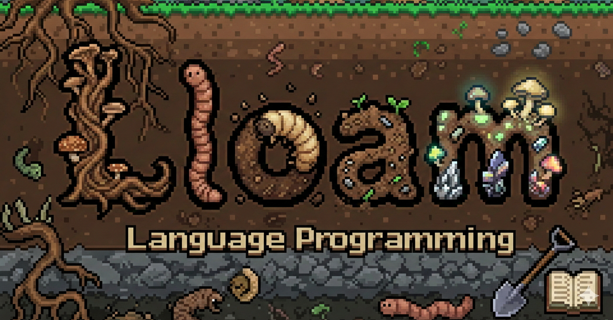

*Rich primitives for building with LLMs*
# Lloam 🌱
Lloam is a minimal prompting library offering a clean way to write prompts and manage their execution. Key features:

- **Parallel:** completions run concurrently
- **Lightweight:** only dependency is `openai`
- **Lloam prompts:** clean function syntax for inline prompts


Lloam treats completions as first-class citizens in the programming model, with built-in concurrency and dependency management. Instead of forcing developers to explicitly handle the asynchronous nature of completions, lloam makes it feel natural within normal Python patterns.


## Usage

```
pip install lloam
```

Overview: [completions](#lloam-completions), [prompts](#lloam-prompts), [agents](#lloam-agents)

### Lloam Completions

`lloam.completion` is a simple and familiar way to generate completions. It returns a `Completion` object which is essentially a wrapper around a token stream. Tokens are streamed concurrently, so the completion won't block your program, 


**Concurrent:** When you create `Completion` objects, token streams are parallelized automatically and don't block until you call `.result()`
```python
import lloam

answer_1 = lloam.completion("What's the meaning of life?")
answer_2 = lloam.completion("How many minutes to hard boil an egg?")
answer_3 = lloam.completion("Who is the piano man?")

# all three completions run in the background
print("The completions are running...")

# .result() will pause until the completion finishes
print(answer_2.result())
print(answer_3.result())
print(answer_1.result())

```


**Streaming:** You can iterate over tokens in a completion as they arrive
```python
messages = [
    {"role": "system", "content": "You answer questions in haikus"},
    {"role": "user", "content": "What's loam"}
]

poem = lloam.completion(messages)

for tok in poem:
    print(tok, end="")

# Soil rich and robust,           
# A blend of clay, sand, and silt,                       
# Perfect for planting.                                  
```

**Stopping conditions:** You can specify stopping conditions with strings and/or regexps
```python

# completion will terminate on,  and exclude either "." or "!"
one_sentence = lloam.completion("Tell me about owls", stops=[".", "!"])

# completion will terminate on closing code block
numbers = lloam.completion(
    "Please write some python, open code blocks with ```python",
    regex_stops=[r"```\s+"],
    include_stops=True
)

```


### Lloam Prompts
Lloam prompts offer a clean templating syntax for writing more complex prompts. `[holes]` are filled in my the language model, and `{variables}` are substituted into the prompt like f-strings. The resulting function returns a `Prompt` object, which is essentially a chain of `Completion` objects. You can access variables and holes as members of the returned `Prompt` object.

- **Postitional and keyword args:** A prompt function supports both positional and keyword args.
- **Hyperparameters:** You can set the model and temperature in the decorator
- **Stopping conditions:** You can specify the stopping conditions of a hole using "up to" array notation and a regexp; `[hole:(rexexp)]` will terminate the completion when the regexp is matched


```python
import lloam

@lloam.prompt(model="gpt-3.5-turbo", temperature=0.9)
def storytime(x, n=5):
    """
    One kind of {x} is a [[name].].

    {n} {name}s makes a [[group].].

    Here's a story about the {group},
    and its {n} {name}s.

    [[story]]
    """

pets = storytime("domestic animal")

print(f"A story about a {pets.group.result()} of {pets.name.result()}s")
# A story about a clowder of cats

for tok in pets.story.stream()
    print(tok, end="")
```

### Lloam Agents
For a real example of a `lloam` agent, check out [Dixie](https://github.com/LachlanGray/dixie)!

Lloam conceptualizes an agent as a datastructure around language. The lloam agent is just a python class that can have langauge state and language methods. 

Here's a sketch of a RAG agent that wraps an arbitrary database, and builds up context over a chat:

```python
import lloam

class RagAgent(lloam.Agent):
    def __init__(self, db):
        self.db = db
        self.history = []
        self.artifacts = {}

    def ask(self, question):
        self.history.append({"role": "user", "content": question})

        # query
        results = self.db.query(question)
        self.artifacts.update(results)

        answer = self.answer(question)

        self.history.append({"role": "assistant", "content": answer.answer})

        return {
            "answer": answer.answer
            "citation": answer.citation
        }


    @lloam.prompt
    def answer(self, question):
        """
        {self.artifacts}
        ---
        {self.history}

        user: {question}

        [[answer]]

        Please provide sources from context

        [[citation]]
        """
```
